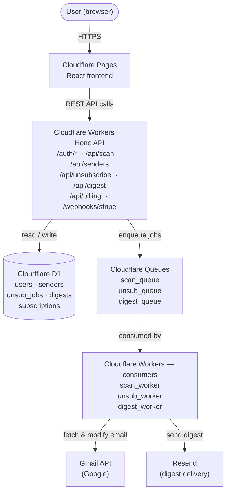

# Vanta

## Product definition

**Inbox cleaner** + **digest rebuilder** – a web app that connects to a user's Gmail via OAuth, detects unwanted senders and newsletters, enables bulk unsubscribe, and rebuilds selected senders into one clean daily digest email.

## Functional requirements

### Authentication

- User signs up/logs in via Google OAuth
- App requests **gmail.readonly** + **gmail.modify** scopes
- Refresh token stored securely for background processing
- User can revoke access and delete all their data

### Inbox scanning

- On first login, scan last 90 days of email
- Identify newsletters, promotional senders, subscription emails
- Detect unsubscribe links (List-Unsubscribe header + body scan)
- Group emails by sender with count, last received date, estimated monthly volume
- **Categorize senders:** newsletter, promotional, transactional, cold outreach, social notification

### Unsubscribe

- One-click unsubscribe per sender
- Bulk unsubscribe selected senders
- **Unsubscribe methods in priority order:** List-Unsubscribe header → unsubscribe link click → auto-draft unsubscribe email
- **Show unsubscribe status:** pending, done, failed
- For senders without unsubscribe — option to auto-archive or auto-delete future emails via Gmail filter

### Digest rebuilder

- User selects senders to include in digest
- Picks delivery time and frequency (daily, weekday-only, weekly)
- System fetches new emails from selected senders daily
- Compiles into one clean digest email and sends via Resend
- Original emails auto-archived (not deleted) after digest inclusion
- User can pause, edit, or delete digest

### Dashboard

- **Overview:** inbox health score, unsubscribed count, emails blocked this week, digest stats
- Sender list with filters (category, volume, status)
- Digest management UI
- **Account settings:** connected account, billing, data deletion

### Billing

- **Free tier:** 25 unsubscribes, no digest
- Paid ($6/month):** unlimited unsubscribes + digest feature
- Stripe checkout + customer portal
- Webhook handling for subscription lifecycle

### Notifications

- **Weekly email summary:** how many emails blocked, digest stats
- Alert if Gmail token expires or access revoked

## Non-functional requirements

### Performance

- Initial inbox scan completes under 60 seconds for 90-day window
- Dashboard loads under 2 seconds
- Digest delivery within 5 minutes of scheduled time
- API responses under 300ms (excluding Gmail API calls)

### Security

- OAuth tokens encrypted at rest (AES-256)
- No raw email bodies stored — extract metadata only
- All API routes authenticated
- Webhook signatures verified
- Rate limiting on all public endpoints
- HTTPS everywhere, HSTS headers

### Privacy

- Minimum data principle — store sender metadata, not email content
- User data fully deletable on request (GDPR Article 17)
- **Clear privacy policy:** what is read, what is stored, what is never stored
- No selling or sharing user data
- Google OAuth app verification required before launch

### Reliability

- Background jobs retry on failure (max 3 attempts, exponential backoff)
- Gmail API quota handling — respect 250 quota units/user/second
- Digest delivery failure alerts user via fallback email
- Graceful degradation if Gmail API is down

### Scalability

- Stateless API — horizontal scaling via Workers
- Background jobs decoupled from API layer via queue
- D1 sufficient to 50k users; migrate to Postgres/Turso if beyond that

### Compliance

- GDPR compliant (EU users)
- Google API Services User Data Policy compliant
- CAN-SPAM compliant for digest emails sent
- Privacy policy + ToS live before OAuth verification submission

## High-level design (HLD)


### External services:

- Google Gmail API — read/modify user email
- Stripe — billing and subscription management
- Resend — transactional + digest email delivery
- Clerk — authentication (has Workers support)

## Low-level design (LLD)

### Database schema

```js
// users
id             text PK
email          text UNIQUE
clerkUserId    text UNIQUE
gmailAccessToken  text (encrypted)
gmailRefreshToken text (encrypted)
tokenExpiresAt integer
scanStatus     text  // idle | scanning | done | failed
lastScannedAt  integer
createdAt      integer
deletedAt      integer  // soft delete

// senders
id             text PK
userId         text FK → users.id
email          text
displayName    text
category       text  // newsletter|promo|transactional|cold|social
emailCount     integer
lastReceivedAt integer
unsubscribeHeader text  // List-Unsubscribe header value if present
unsubscribeUrl text
status         text  // active|unsubscribed|in_digest|archived

// unsubscribe_jobs
id             text PK
userId         text FK
senderId       text FK → senders.id
method         text  // header|link|email|filter
status         text  // queued|processing|done|failed
attempts       integer DEFAULT 0
lastAttemptAt  integer
completedAt    integer
errorMessage   text

// digests
id             text PK
userId         text FK
name           text
deliveryTime   text  // "08:00"
timezone       text
frequency      text  // daily|weekdays|weekly
status         text  // active|paused
lastSentAt     integer
createdAt      integer

// digest_senders
digestId       text FK → digests.id
senderId       text FK → senders.id
PRIMARY KEY (digestId, senderId)

// subscriptions
id             text PK
userId         text FK
stripeCustomerId    text UNIQUE
stripeSubscriptionId text UNIQUE
plan           text  // free|pro
status         text  // active|past_due|canceled
currentPeriodEnd integer
```

### Inbox scan flow

#### User logs in

```js
    → POST /api/scan triggered
    → Job pushed to scan_queue with { userId, accessToken }
    → scan_worker picks up job
    → Gmail API: list messages, last 90 days
       (batched: 100 message IDs per request)
    → Gmail API: batch get message headers
       (From, Subject, List-Unsubscribe, Date)
       (never fetch body for privacy)
    → Group by sender email
    → Classify sender category (rule-based + heuristics)
    → Upsert senders table
    → Update user.scanStatus = done
    → Push scan_complete event to frontend via polling
```

### Unsubscribe flow

#### User clicks unsubscribe

```js
    → POST /api/unsubscribe { senderId }
    → Create unsubscribe_job record (status: queued)
    → Push to unsub_queue
    → unsub_worker picks up:
        if List-Unsubscribe: mailto → send unsubscribe email via Gmail
        if List-Unsubscribe: http  → POST to unsubscribe URL
        if unsubscribeUrl found    → headless HTTP request to URL
        else                       → create Gmail filter to auto-archive
    → Update job status
    → Update sender status = unsubscribed
    → Retry on failure (max 3, exponential backoff: 1m, 5m, 15m)
```

### Digest delivery flow

#### Cloudflare Cron Trigger: every 15 minutes

```js
    → query digests where next delivery time has passed
    → for each digest:
        → fetch new emails from digest senders since last run
           (Gmail API search: from:sender1 OR from:sender2 after:date)
        → extract subject, snippet, sender name, email URL
        → compile into digest email template (React Email)
        → send via Resend
        → archive originals in Gmail (add ARCHIVED label, remove INBOX)
        → update digest.lastSentAt
```

### Token refresh flow

#### Before every Gmail API call:

```js
    → check token.expiresAt
    → if expires in < 5 minutes:
        → POST to Google token endpoint with refresh_token
        → update encrypted access token in D1
        → proceed with refreshed token
    → if refresh fails (token revoked):
        → mark user.scanStatus = token_expired
        → send re-auth email via Resend
```

## Key technical considerations

#### Gmail API quota management

Google gives 250 quota units per user per second. A messages.list costs 5 units, messages.get costs 5 units, batch requests help but don't eliminate the cap. Your scan worker must implement per-user rate limiting — process in batches of 20 messages with 100ms delay between batches. First scan for a heavy inbox (10k+ emails) may take 2–3 minutes. Show a progress indicator, don't timeout.

#### Unsubscribe reliability

List-Unsubscribe header (RFC 2369) is the cleanest method — supported by all reputable senders. One-click unsubscribe (RFC 8058) is even cleaner — a single POST. However roughly 30% of newsletters don't include these headers. For those you need link extraction from email body — which means fetching the email body, which you want to avoid for privacy. Compromise: fetch body only for unsubscribe link extraction, process in memory, never persist.

#### Google OAuth app verification

gmail.modify is a restricted scope. Google requires a security assessment by a third party (CASA Tier 2) before approving apps with 100+ users. This costs ~$75–150 and takes 2–4 weeks. You can launch and test with up to 100 users unverified — the consent screen shows a warning but works. Budget time and money for this before you scale.

#### Cloudflare Workers limitations

- **CPU time:** 10ms free / 50ms paid — fine for API routes, not fine for heavy scanning. - Scan and digest workers need to be separate Workers triggered by queues, not the API worker itself.
- D1 is SQLite — no full-text search, no array columns, limited concurrent writes. - For your schema this is fine.
- **Queues:** Cloudflare Queues are in GA, free tier includes 1M deliveries/month — enough to start.

#### Data privacy architecture

- Never store email bodies or subjects in D1. The scan worker extracts only: sender email, sender display name, List-Unsubscribe header, received date, and email count.
- Subjects are used only for digest compilation — held in memory during the Worker execution, passed directly to Resend, never written to D1. This makes your privacy policy honest and simple.

#### Digest email deliverability

You're sending email on behalf of your users to themselves. Use Resend with a custom domain (e.g. digest@yourdomain.com). Set up SPF, DKIM, DMARC on that domain. Resend handles this well. Don't send from a shared IP pool — Resend's dedicated IPs are available on paid plan, worth it once you have volume.
